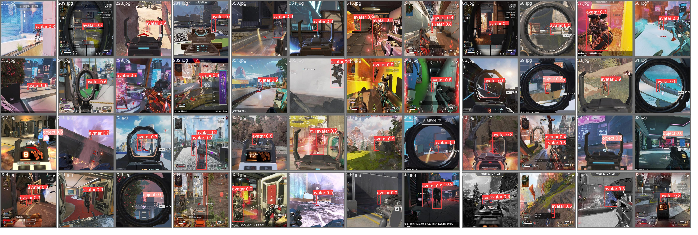

# Object detection for Apex Legends

**Dataset:** [apex-videogame](https://huggingface.co/datasets/Francesco/apex-videogame) from Hugging Face

**Models**:
  - R-CNN: based on PyTorch [Object Detection Finetuning Tutorial](https://pytorch.org/tutorials/intermediate/torchvision_tutorial.html)
  - YOLOv5: from [ultralytics/yolov5](https://github.com/ultralytics/yolov5)

